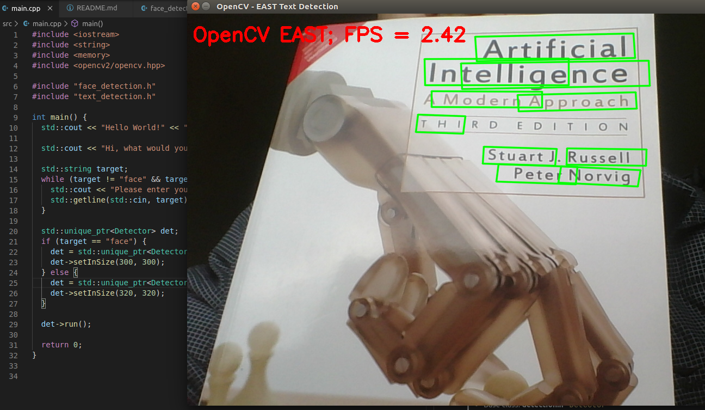

# CPPND: Capstone: Detector
This project utilizes different trained deep neural networks to detect corresponding targets, like face or text.

## Dependencies for Running Locally
* cmake >= 3.7
  * All OSes: [click here for installation instructions](https://cmake.org/install/)
* make >= 4.1 (Linux, Mac), 3.81 (Windows)
  * Linux: make is installed by default on most Linux distros
  * Mac: [install Xcode command line tools to get make](https://developer.apple.com/xcode/features/)
  * Windows: [Click here for installation instructions](http://gnuwin32.sourceforge.net/packages/make.htm)
* gcc/g++ >= 5.4
  * Linux: gcc / g++ is installed by default on most Linux distros
  * Mac: same deal as make - [install Xcode command line tools](https://developer.apple.com/xcode/features/)
  * Windows: recommend using [MinGW](http://www.mingw.org/)
* OpenCV >= 3.4

## Basic Build Instructions

1. Clone this repo.
2. Make a build directory in the top level directory: `mkdir build && cd build`
3. Compile: `cmake .. && make`
4. Make sure your webcam works
5. Run it: `./HelloWorld`.

## Code Overview
### src/
* Base class: **detection.h** - `Detector`
  * Child class: **face_detection.h** - `FaceDetector`
  * Child class: **text_detection.h** - `TextDetector`
* **main.cpp**

### models/
This folder stores the trained network model files downloaded from websites.

## Expected Output
* Text
  